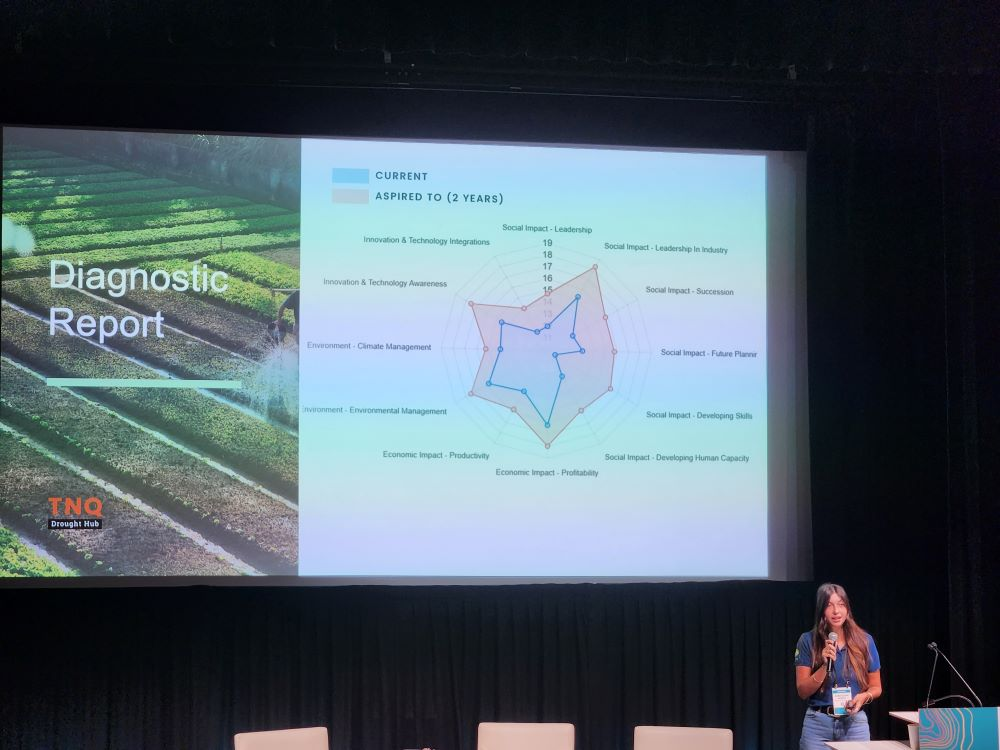
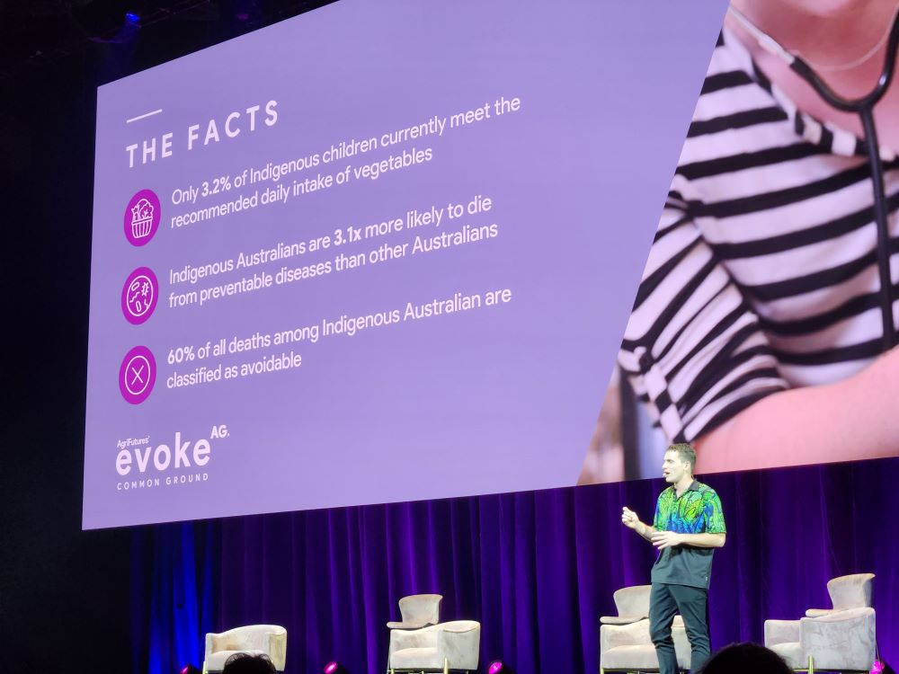
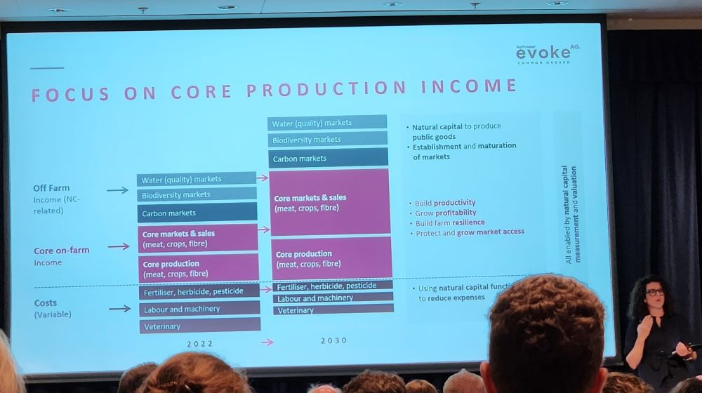
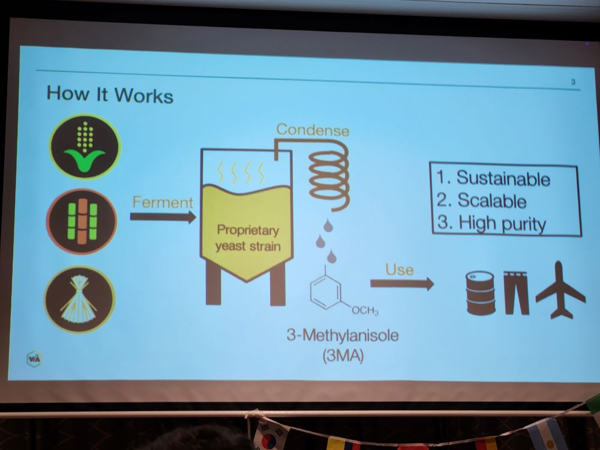
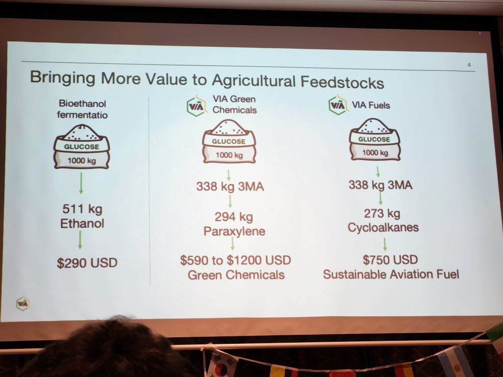
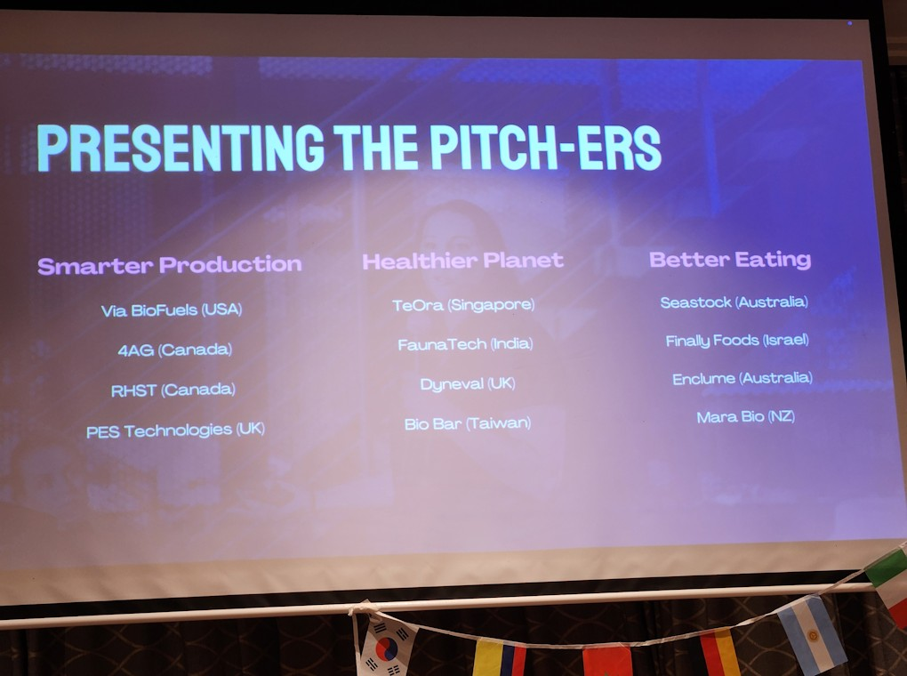
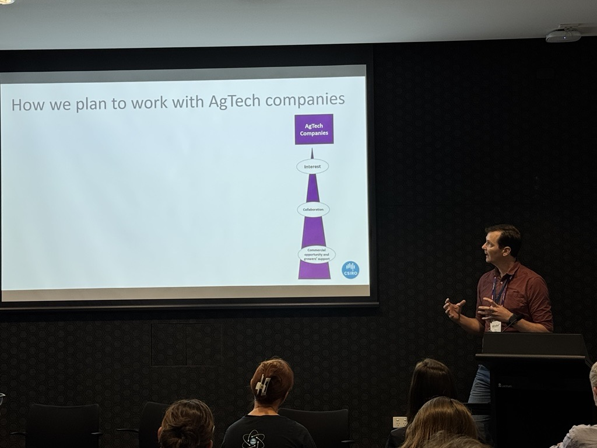
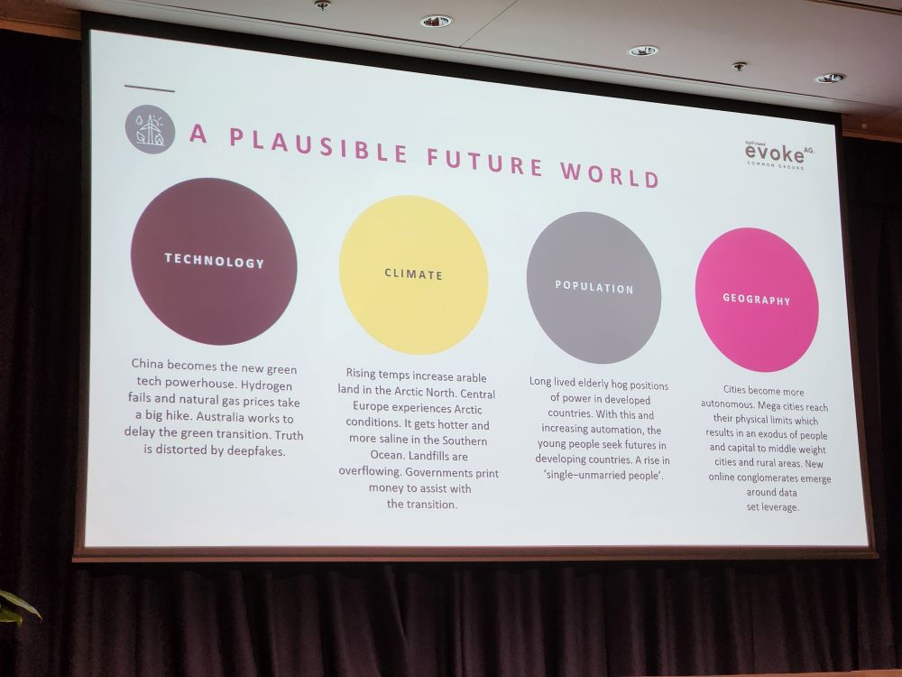

   

## Day 0 - 2025-02-10  
### Sideline Event - QLD AgTech Summit  

Kicking off the week was the [Queensland Governments *AgTech Summit*.](https://www.daf.qld.gov.au/news-media/campaigns/agtech/action/qld-agtech-summit)
While networking was a key highlight for everyone attending, one of the keynotes
by Jerome Leroy of [InFarm](https://www.infarm.io/), conveyed some insights for 
aspiring start-ups and researchers alike.
Not only should AgTech interventions be driven by solving a problem growers have
they need to provide **Value**.  

  $Value = \frac{Outcome \times Trust^{*}}{Effort \times Time \times Cost} \times Perceived Risk$  
  \*trust = Probability it works x Intent  

   
  
To unpack this equation further; with out building trust in the delivery of an
'outcome' or (Agtech product) and the *intent* to follow-up on issues or servicing
the 'outcome' with support it has a **_low value_** to growers.
Additionally effort, time and cost to adopt, the lower the value of the technology
to growers. 
There are many ways you can cut this equation, however it comes down to fact growers
are wise to the parade of snake oil merchants and need to see there is _value_ 
in the *time*, *effort* and *cost* to adopt new tech. 
Additionally given the weather dependant nature of farming, growers will only 
have the probability of a big pay check three to six times in a standard 30 year 
career.
Reinforcing the need to see the value in the technology before adopting it.  

{width=60%}  

Another stand out example of poor relationship between researchers and growers 
was provided by Natalie Engel (If I recall correctly). 
After they were contacted by a researcher about hosting some research they sort
legal advice at the cost of $400. 
However the researcher never returned their call and they were left out of pocket
despite being interested in hosting the researchers.  

A surprising hit session (*for me*) for the day was the concurrent session 
*"Protecting and funding innovation: R&D tax incentives and IP eligibility"* 
presented by [Mark Metzeling](https://mk.com.au/people/mark-metzeling/). 
As a researcher who regularly seeks collaboration with growers for on farm trials,
or SME to fund research, I wanted to know what tax incentives are available these
potential partners. 
Mark explained that for businesses with less than $20 million dollars in turnover,
43% of all costs associated with research and development can be claimed as an 
offset.  

Requirement to claim R&D offsets, however include:  

  1. Registering the business with 
[AusIndustry](https://www.industry.gov.au/science-technology-and-innovation/industry-innovation/ausindustry).  
  2. Registering the intent to undertake R&D for the financial year, within 10 
  months of the end of the financial year.  
  3. Maintain records showing research hypothesis, methods, and notes on 
  supervision of the trial and a summary of the results.  

Mark also strongly recommended using a accountant that solely specialises in R&D
tax offset accounting when claiming these costs.  

   

I was struck by the nice visual representation of benchmarking with radar charts 
by the [Tropical North Queensland (TNQ) Drought hub](https://www.tnqdroughthub.com.au/) team.  

{width=60%}

   
   
   

## Day 1 - 2025-02-11  
### EvokeAg  

I arrived early to the conference so I could visit many of the trade displays 
before the plenary. 
I talked to the crew at [BeeStar](https://www.beestar.com.au/), who have a hive
management system and sensors to monitor hive health. 
We briefly discussed their involvement in the "Bee2Tree" program, were growers 
share pesticide application intentions with bee keepers with hives in the area.
This trial program intrigued me as it deals with the tricky issue of sharing 
sensitive data with unknown third parties.  
I inspected [FarmLab's](https://getfarmlab.com/) platform, which provides a chain
of custody around soil samples and analysis.
Impressively the platform is built on military grade software to ensure samples
are collected in a standardised manner and the data is secure.  

{width=60%}

Following the opening ceremony was an interactive plenary where the audience was
invited to nominate talking points on the greatest challenges for the Australian 
Agriculture and Horticultural industry.
A feisty discussion with at times reflected on the poor relationship between 
growers and researchers. 
I copied all 124 [slido](https://www.slido.com/) responses from the audience and 
asked a LLM to summarise the top talking points.  

Some key points that emerged from the conversation (according to the LLM) include:  

>  **1.  Lack of national workforce strategy:** There seems to be a consensus 
  that Australia does not have a comprehensive national workforce strategy for 
  the agricultural industry.  
  
>  **2. Need for food security policy:** Several participants suggested that a 
  food security policy is needed to sit under a workforce development strategy, 
  as there currently is no clear framework in place.  
  
>  **3. Importance of identifying and removing barriers:** One participant 
  suggested that a national workforce strategy should focus on identifying and 
  removing barriers to entry, rather than trying to create artificial barriers 
  to competition.  
  
>  **4. Need for innovation and technology adoption:** Some responses voiced  
  frustration that research in agriculture is sometimes disconnected to the 
  development of new technologies to improve productivity.  
  
>  **5. Concerns about venture funding:** Responses expressed concerns that 
  reliance on venture capital funding may not be sufficient to support the growth 
  of the agricultural industry, particularly in terms of investment in itself.  
  
>  **6. Water security:** Several participants discussed the need for Australia to 
  secure and guarantee its water supply in order to remain competitive globally.  
  
>  **7. Competitiveness:** The conversation touched on the need for Australia to 
  address issues such as input costs (e.g., inputs like fertilizer, and water) 
  which are eating into profit margins.  

My takeaway from most of this discussion was that most attendees were not aware 
of the difference between research for innovation or discovery.
And that shortfalls in government funding for universities these days have 
resulted in a sector that is predominantly focused on servicing the education 
sector rather research for industry.  

   

#### [Malachai Clements: 2025 Groundbreaker](https://www.linkedin.com/in/malachai-clements-477b32257/)  
   

I caught a bit of Malachi Clements talk about improving indigenous nutrition 
through permaculture and community gardens.
Such a great initiative, amazing to see collective grass-roots action having such
great impact in rural communities.

  
{width=60%}

   

   

### Natural Capital  

Following lunch I ducked into "Is natural capital the answer?" breakout room to
place additional context around the role of natural capital for supporting 
beneficial insect populations and suppressing pests in broadacre cropping.
The session posed the question, 

> "What value can natural capital bring to the agricultural sector.  

Then asked us to work in groups to brainstorm a pitch to highlight the value
of increasing natural capital on farms.
Surprisingly I found the wider discussion disconnected to, what I view are, 
the perspectives of regional producers.
Focusing on the value of natural capital in terms of carbon sequestration and
doing right by future generations. 
While these are noble goals to champion, which producers would love to aspire to,
at the end of the day growers are running a business and prioritise the keeping
their business profitable.
I think it could have had greater impact if it focused on the value of natural 
capital to their business in terms of resilience to erosion, drought, pests and
diseases.  

   

{width=60%}

   

Our table pitched ideas around these ideas, to improve the public perspective of
what natural capital can contribute to the agricultural sector, beyond the talking
points of city think-tanks. 
Shout out to [Hannah Schuch](https://www.linkedin.com/in/hannah-schuch/), 
[Carolyn Hope](https://mapof.ag/team-member/caroline-hope/) and 
[Jo Grainger](https://www.linkedin.com/in/jo-grainger-718493b8/) who provided some 
great ideas to our pitch.  

Disappointingly I had to miss the role playing in the "What do you do? Real decisions, 
in a hypothetical crisis". 
This was a session where panellists with varied roles in Ag, business and trade 
played out a hypothetical crisis around a data breach of a major hypothetical 
AgTech company "FarmCorp".  

The evening officially concluded with the "Festival of Food", samples of dishes 
using local ingredients. 
By this time in the evening my mental capacity for coherent conversation was waning
and I found myself at a table with an early career irrigation sales rep from Bundaberg 
and lovely lady with a mind sharp as a knife who I later realised was 
[Cathy McGowan AO](https://www.aph.gov.au/Senators_and_Members/Parliamentarian?MPID=123674).

   

### Side Event - AgTech Pitch  

Semi-unofficially the night continued on at the Rydges hotel with the International
AgTech Pitch, touted as a raucous event pitting representatives of start-ups
from around the world.  

There were many great talks and I especially found interesting the amount of 
start-up pitches focused on fermentation on-farm. 
These technologies are looking to deliver fermentation tanks which can use crop
residues, like baggase and other crop stubble, to make chemical molecules that 
are precursors to jet fuel and other industrial practices.
I like how this might fit into future farms, that are potentially net energy 
producers, maybe with enough additional power to have portable Haber-Bosch machines
synthesising fertilisers from the atmosphere.  

   
{style="float: left" width=49%}
{style="float: right" width=49%}

   
   

The presentation that took away the top gongs was a pitch by [Rachel Smith](https://www.linkedin.com/in/rachel-smith-woodside/) 
from [Enclume](https://www.enclume.com.au/).
Rachel pitched a robotic remote sensing rig that can monitor crop phenology experiments
with a cable suspended camera. 
This invention circumvents [CASA](https://www.casa.gov.au/) restrictions which 
require drone pilots to be monitoring or present when in control of miniature aircraft.  

   

{width=60%}

   

## Day 2 - 2025-02-11  
### Sideline event - Extending Research Impact Breakfast  

In the morning of day two CSIRO's [Catalysing Australia's Biosecurity (CAB)](https://www.csiro.au/en/about/challenges-missions/biosecurity) 
mission hosted a breakfast at the Ecosciences Precinct. 
I helped host this sideline event where we highlighted the [PestREADIs](https://research.csiro.au/pestreadi/) 
role with CAB, and the co-design process for designing decision support tools for 
primary producers. 
There was some excellent engagement with the attendees and potentially new contacts
made to collaborate with co-design projects.
If you would like to know more and find out if you can be involved please [contact me](mailto:paul.melloy@csiro.au)
or go to our [website](https://research.csiro.au/pestreadi/).  

   

  
{width=60%}  

   

#### The Future of food production  

Another connect & collaborate session drew my eye early on the second day, 
"The future of food: Innovate or fall behind". 
This followed a hypothetical of where do we see agriculture and horticulture in 
25 years time? 
Not only were we thinking of the aspiring technologies that will be available, 
but also the social and economic drivers that could constrain the supply chains.  

   

  
{width=60%}  

   

Our team thought back of how far we have come in the last 25 years, as a indicator
to the progress we could make in the next quarter century. 
We came up with a disruptive industry taking advantage of downsizing farming at
scale that could happen with robotics, automation and gig economies.
Our idea "Air-farm" is a company that allows farming corporate stakeholders to 
lease land and equipment to farm managers and small businesses looking to deliver
bespoke products with a story to end consumers.  

   

#### Intimate connections with change makers  

I dropped into another connect and collaborate session to connect and discuss 
some of the challenges facing the agricultural industry with industry leaders.
I sampled conversations where primary producers were really struggling to meet
the increasing compliance requirements placed on them by Supermarkets and the
wider industry. 
I also chatted with [Simon Butler from Agronomeye](https://agronomeye.com.au/about/)
about the role of remote sensing in leverageing benefits to natural capital.  

#### 3D ocean farming  

Bren Smith from [GreenWave](https://www.greenwave.org/) gave an entertaining talk 
about his experience with "Tech Bro's" with large financial interests moving too
fast to deliver half baked green promises to keen investors. 
Bren did not mince words and highlighted the folly of moving too quickly on 
over hyped technology that attracts large capital with insufficient validating hard 
data. 
His talk was a real window into the anger of US working class people towards the big
business elites who trample all over them in pursuit of cash. 
His point of view showed why the country elected a divisive leader promising to 
disrupt the disrupter's, and return the power to the working class.
It would also be remiss of me not to mention his farmer collective achieve more 
with less, to deliver a carbon negative ocean farming system that is profitable.  

   

#### Big bold questions  
Closing out the event was a session inviting a unrestrained discussion on the 
key challenges which arose over the two day event.
I unfortunate did not get a list of the responses and could not summarise them.  

Cathy McGowan AO gave a great closing address, and urged everyone to consider 
how they will make a difference in the next 12 months within their circle of 
influence.  

