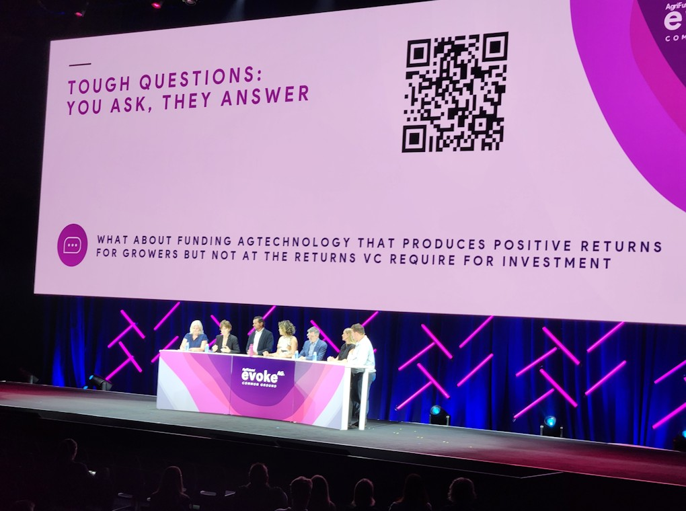

### Queensland AgTech Summit  

Kicking off the week was the [Queensland Governments *AgTech Summit*.](https://www.daf.qld.gov.au/news-media/campaigns/agtech/action/qld-agtech-summit)
While networking was a key highlight for everyone attending, one of the keynotes
by Jerome Leroy of [InFarm](https://www.infarm.io/), conveyed some insights for 
aspiring start-ups and researchers alike.
Not only should AgTech interventions be driven by solving a problem growers have
they need to provide **Value**.  

  $Value = \frac{Outcome \times Trust^{*}}{Effort \times Time \times Cost} \times Perceived Risk$  
  \*trust = Probability it works x Intent  

   
  
To unpack this equation further; with out building trust in the delivery of an
'outcome' or (Agtech product) and the *intent* to follow-up on issues or servicing
the 'outcome' with support it has a **_low value_** to growers.
Additionally effort, time and cost to adopt, the lower the value of the technology
to growers. 
There are many ways you can cut this equation, however it comes down to fact growers
are wise to the parade of snake oil merchants and need to see there is _value_ 
in the *time*, *effort* and *cost* to adopt new tech. 
Additionally given the weather dependant nature of farming, growers will only 
have the probability of a big pay check three to six times in a standard 30 year 
career.
Reinforcing the need to see the value in the technology before adopting it.  

{width=60%}  

Another stand out example of poor relationship between researchers and growers 
was provided by Natalie Engel (If I recall correctly). 
After they were contacted by a researcher about hosting some research they sort
legal advice at the cost of $400. 
However the researcher never returned their call and they were left out of pocket
despite being interested in hosting the researchers.  

A surprising hit session for the day was the concurrent session 
*"Protecting and funding innovation: R&D tax incentives and IP eligibility"* 
presented by [Mark Metzeling](https://mk.com.au/people/mark-metzeling/). 
As a researcher who regularly seeks collaboration with growers for on farm trials,
or SME to fund research, I wanted to know what tax incentives are available these
potential partners. 
Mark explained that for buisnesses with less than $20 million dollars in turnover,
43% of all costs associated with research and development can be claimed as an 
offset.
Requirement to claim R&D offsets, however include, 
  1. Registering the business with 
[AusIndustry](https://www.industry.gov.au/science-technology-and-innovation/industry-innovation/ausindustry).  
  2. Registering the intent to undertake R&D for the financial year, within 10 
  months of the end of the financial year.  
  3. Records showing research hypothesis, methods, and notes on supervision of the 
  trial and a summary of the results.  

Mark also strongly recommended using a accountant that solely specialises in R&D
tax offset accounting when claiming these costs.  

 

### EvokeAg  

I arrived early to the conference so I could visit many of the trade displays 
before the plenary. 
I talked to the crew at [BeeStar](https://www.beestar.com.au/), who have a hive
management system and sensors to monitor hive health. 
We briefly discussed their involvement in the "Bee2Tree" program, were growers 
share pesticide application intentions with bee keepers with hives in the area.
This trial program intrigued me as it deals with the tricky issue of sharing 
sensitive data with unknown third parties.  
I inspected [FarmLab's](https://getfarmlab.com/) platform, which provides a chain
of custody around soil samples and analysis.
Impressivley the platform is built on military grade software to ensure samples
are collected in a standardised manner and the data is secure.  

{width=60%}

Following the opening ceremony was an interactive plenary where the audience was
invited to nominate talking points on the greatest challenges for the Australian 
Agriculture and Horticultural industry.
A feisty discussion with at times reflected on the poor relationship between 
growers and researchers. 
I copied all 124 slido responses from the audience and asked a LLM to summarise 
the top talking points.  

Some key points that emerged from the conversation include:  

>  **1.  Lack of national workforce strategy:** There seems to be a consensus 
  that Australia does not have a comprehensive national workforce strategy for 
  the agricultural industry.  
  
>  **2. Need for food security policy:** Several participants suggested that a 
  food security policy is needed to sit under a workforce development strategy, 
  as there currently is no clear framework in place.  
  
>  **3. Importance of identifying and removing barriers:** One participant 
  suggested that a national workforce strategy should focus on identifying and 
  removing barriers to entry, rather than trying to create artificial barriers 
  to competition.  
  
>  **4. Need for innovation and technology adoption:** Some responses voiced  
  frustration that research in agriculture is sometimes disconnected to the 
  development of new technologies to improve productivity.  
  
>  **5. Concerns about venture funding:** Responses expressed concerns that 
  reliance on venture capital funding may not be sufficient to support the growth 
  of the agricultural industry, particularly in terms of investment in itself.  
  
>  **6. Water security:** Several participants discussed the need for Australia to 
  secure and guarantee its water supply in order to remain competitive globally.  
  
>  **7. Competitiveness:** The conversation touched on the need for Australia to 
  address issues such as input costs (e.g., inputs like fertilizer, and water) 
  which are eating into profit margins.  

My takeaway from most of this discussion was that most attendees were not aware 
of the difference between research for innovation or discovery.
And that shortfalls in government funding for universities these days are have 
resulted in a sector that predominantly to service the education sector rather 
research for industry.  

