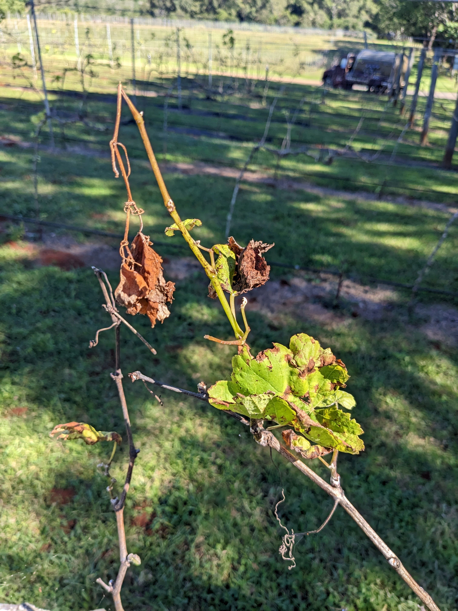
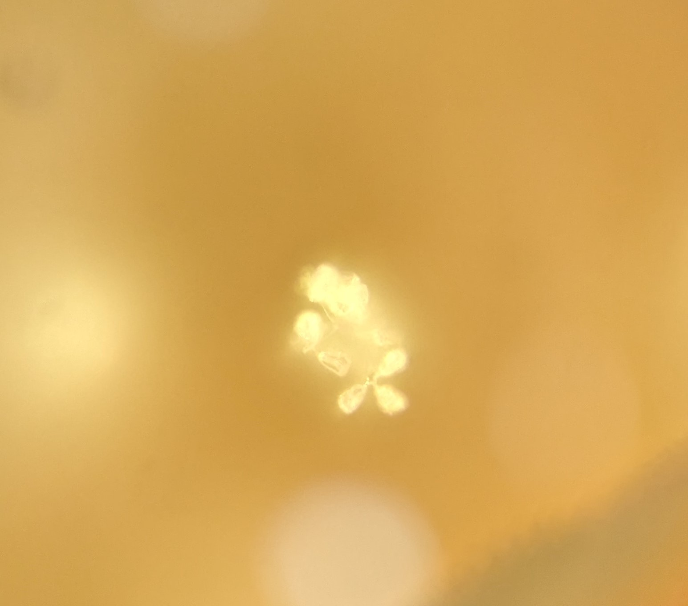
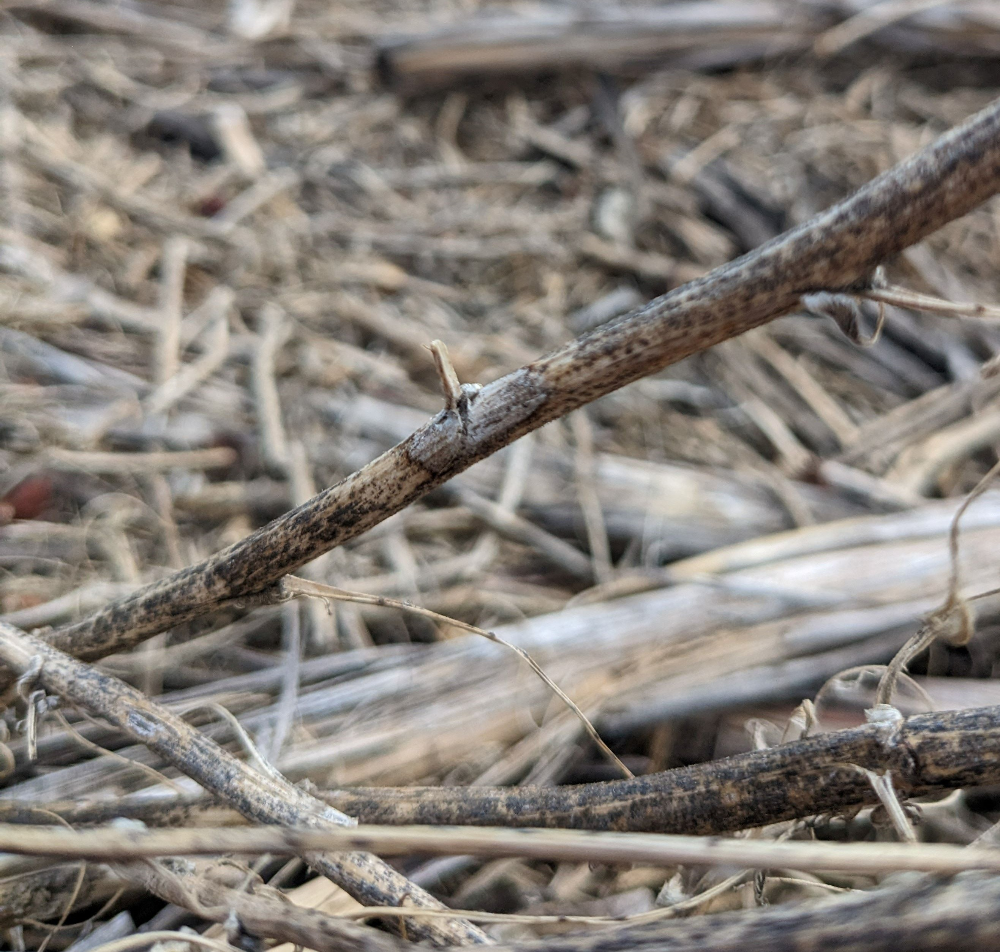

I am a Plant Pathologist at the [University of Queensland.](https://www.uq.edu.au/)
I specialise in modelling crop diseases and building decision support tools.  
Read about my recent research below, and if you are interested in collaborating
on a research topic, visit my [UQ researchers page.](https://researchers.uq.edu.au/researcher/37467)

  
  

***  

## Recent work 

### UQ Agri-Food Innovation Alliance grant  
#### May 2023  
A quick visit to [Cauldron Distillery and Winery](https://www.cauldrondistillery.com.au/) 
to take soil and leaf samples for the UQ Industry Kick-starter project.  

While it was late in the season and the vines entering dormancy, we found, (Left) 
possible phosphorus deficiency in the ferrosol soils, and (Right) Possible downy mildew.  

{width=43.5%}
{width=55%}  

   

Leaf samples revealed downy mildew _Plasmopara viticola_. 
Below: (Left) Sporangiophore, (Right) Sporangia  

{width=45%}
{width=50%}  

   

### UQ Agri-Food Innovation Alliance grant  
#### April 2023  
I am extremely excited to announce [Dr Anthony Young](https://agriculture.uq.edu.au/profile/4625/anthony-young) 
and myself were successful in an [Industry Kickstarter grant](https://agriculture.uq.edu.au/research/research-centres-and-groups/uq-agri-food-innovation-alliance/find-funding-or-research-partners)
to develop a "Decision support tool to support speciality smallholders and farm-gate 
producers."  

We are working with [Cauldron Distillery and Winery](https://www.cauldrondistillery.com.au/) 
in Mt Tamborine, south of Brisbane, to assess the efficacy of organic and synthetic 
fungicide timing on foliar grape vine diseases, powdery mildew and downy mildew. 
The field trial will assist in refining a decision support tool which will help 
smaller farm gate producer manage disease with lower costs and fungicide applications.  

***  

### [The influence of temperature and vapour pressure deficit on conidial germination and germ tubes production in an Australian _Podosphaera xanthii_ isolate.](https://paulmelloy.github.io/P_xanthii_titlepage.html)  

#### March 2023  
This paper has been accepted and published in the European Journal of Plant Pathology.
[https://doi.org/10.1007/s10658-023-02664-5](https://doi.org/10.1007/s10658-023-02664-5)  

   

***

### Sampling Ascochyta rabaeii for field experiment  
#### February 2023  

Following the Goondiwindi GRDC updates I drove home via the Eastern Darling Downs
to collect some Ascochyta infested chickpea stubble. 
This will be used for inoculum in a field trial we are planning later this year.  

{width=60%}

Stay tuned!!!

***  
### [The influence of temperature and vapour pressure deficit on conidial germination and germ tubes production in an Australian _Podosphaera xanthii_ isolate.](https://paulmelloy.github.io/P_xanthii_titlepage.html)  

#### November 2022  
I am pleased to share a pre-print of a paper I have been assisting with, titled, 
"The influence of temperature and vapour pressure deficit on conidial germination 
and germ tubes production in an Australian _Podosphaera xanthii_ isolate."
The paper has been submitted for review at the [European Journal of Plant Pathology](https://www.springer.com/journal/10658). The work was undertaken as part
of Zaiton Sapak's PhD and furthers our understanding on the temperature and vapour 
pressure conditions which influence germination rate and infection success of 
_P. xanthii_ on cucurbit leaves.  

Powdery mildew is at a high risk of evolving fungicide resistance and improper 
applications can be costly, hastening the evolution of fungicide resistance. 
Understanding the conditions at which the crop is at risk of infection will lead 
to the development of models and decisions support tools which increase the lead 
time to prepare for fungicide applications and timing sprays for maximum efficacy, 
reducing excessive spray applications or the immediate cost of applying ineffective 
poorly timed sprays.  

The results from this paper show the optimum conditions for rapid conidia germination
and the production of secondary and tertiary germ-tubes (a proxy for successful 
infection) was 28°C at saturated vapour pressure. Germination was prevented at 
temperatures above 34°C and below 8°C and reduced at other temperatures. As vapour 
pressure deficit increased germination and germ tube production decreased in a 
non-linear relationship and never completely prevented conidial germination or 
germ-tube production.  

I assisted with statistical analysis and final drafts of the paper. If you wish 
to read the pre-print, you can download it from Zenodo. 
  

[You can also find the full statistical analysis and code at the research compendium here.](https://paulmelloy.github.io/P_xanthii_titlepage.html).  

***  

### National Pulse Pathology Meeting & Ascochyta blight Workshop  
#### October 2022  
An amazing week of presentations and discussions around pulse pathology and ascochyta
blight research in chickpea. 
I had a great time learning about chickpea breading efforts and disease epidemiology
research.
I came away with some excellent insights that I wish to apply as improvements to 
the `ascotraceR` model. Watch this space.

  

***  

### GRDC Update - Miles - Pitsworth - Goondiwindi  
#### July 2022  
At the end of July, I travelled around South East Queensland to the GRDC Updates
to present the decision support tools which have been developed on the GRDC funded
project I am involved with. A second la nina at the start of 2022 has provided a 
lot of moisture which are likely to lead to heavy losses to foliar diseases if crops
are not managed well for disease.  

The main apps we were presenting for the Northern grains region were
[StripeRustWM](https://www.agric.wa.gov.au/apps/striperustwm) 
and [YellowSpotWM](https://www.agric.wa.gov.au/apps/yellowspotwm-yellow-leaf-spot-management).  

There was a lot of interest in the applications and many were not yet familiar with
the available suit of decision support tools (DST). With a full moisture profile across 
many of the cropping areas those who were able to sow had more options. With seemingly 
more growers from the Goondiwindi region going into canola. Some farm managers were
therefore interested in the canola DSTs [SclerotiniaCM](https://www.agric.wa.gov.au/apps/sclerotiniacm-sclerotinia-management-app),
and [UCI BlackLegCM](https://www.agric.wa.gov.au/apps/uci-blacklegcm-blackleg-upper-canopy-infection-management-app).

  

***  

### Farms Advice - Plant disease modelling interview
#### June 2022
I had a great chat with ABC rural trailblazer [Jack Cresswell](https://twitter.com/jcressw3) on his [Farms Advice](https://farmsadvice.com.au/) pod-cast.  

[Follow this link to the interview.](https://anchor.fm/farmsadviceau/episodes/Plant-Disease-Modelling-in-Broadacre--Paul-Melloy-e1ji1kl)  

Or search for 'Farms Advice' in your pod-cast app.  

***  

### Simulation model for ascochyta blight  
#### May 2022  

`ascotraceR` is an R package which simulates ascochyta blight epidemics in chickpea
crops.
You can find `ascotraceR` on CRAN, and a resource announcement in *Phytopathology*.

[ascotraceR: An R Package Resource to Simulate the Spatiotemporal Spread of Ascochyta Blight in a Chickpea Field Over a Growing Season](https://apsjournals.apsnet.org/doi/10.1094/PHYTO-01-22-0016-A)

***  

### Is UniSuper's Defined Benefit Division fund worthwhile Shiny App  
#### May 2022  

Choice of superannuation is not the first type of research people like to do when starting a new job.
Most people want to finish the induction paperwork and financial forms as quickly as possible so they can commence diligently working for their new employer.
Therefore I gather most people would not fully dedicate their time to trying to understand 'What is a defined benefit division?' and 'Is it the best super product for me?'.
I certainly did not when I started work with the University of Southern Queensland almost four years ago.
I was coerced into UniSuper's DBD and only 3 years down the track I realise it was not for me.  

When checking up on my super balance, shortly after starting work at The University of Queensland, 
I noticed that the total contributions I made from my salary after tax exceeded the fund balance.
Suffice to say, I liken the DBD to a pyramid scheme which only benefits people who are over the age of 50. 
In fact it is almost impossible to have a positive net return if you exit the fund before the age of 46.  

To help people understand how the DBD is calculated I created a shiny app which can be found at the following link
[https://paulmelloy.shinyapps.io/UniSuperDBD/](https://paulmelloy.shinyapps.io/UniSuperDBD/)  

***  

### 2022 Election shiny app  
#### May 2022  

I have been working on a shiny app to help a political party I am a member of, 
the [Fusion Party, *Science, Pirate, Secular and Climate Emergency Parties*](https://www.fusionparty.org.au/)  
The shiny app was made to easily convert electoral boundaries data from shape file
to `KML` file so they could be uploaded on a shared Google maps. 
Needless to say the app expanded monstrously when I found more data on the [AEC website](https://results.aec.gov.au/24310/Website/HouseDownloadsMenu-24310-Csv.htm).  

I included some analysis of voting preferences by division and voting booth, including
expected voter turnout to booths.  
Check out the app at https://paulmelloy.shinyapps.io/22_electoralboundaries/  

***  

### Estimating leaf temperature from NASA satellite data  
#### April 2022  

I wrote a blog, published on OpenPlantPathology's website, for how to use R to 
estimate leaf temperatures from data retrieved using the `nasapower` R package. 
Then plugging the data into functions from the R package `tealeaves`.
The result is being able to estimate the leaf temperature for any where on the planet.

[Click here to read the blog post](https://openplantpathology.netlify.app/posts/2022-04-01-powerful-tea-using-nasapower-and-tealeaves-to-obtain-leaf-temperatures/)

***  

### Efficient control of powdery mildew in mungbeans  
#### November 2021  

This paper uses meta-analytic methods to examine 16 field trials over eight seasons assessing fungicide spray timing for control of powdery mildew.  

[Read the paper in *Plant Disease*](https://apsjournals.apsnet.org/doi/10.1094/PDIS-06-21-1256-RE).  

[Recreate the analysis by following the research compendium.](https://openplantpathology.github.io/Mungbean_PM/preliminary-analysis.html)

