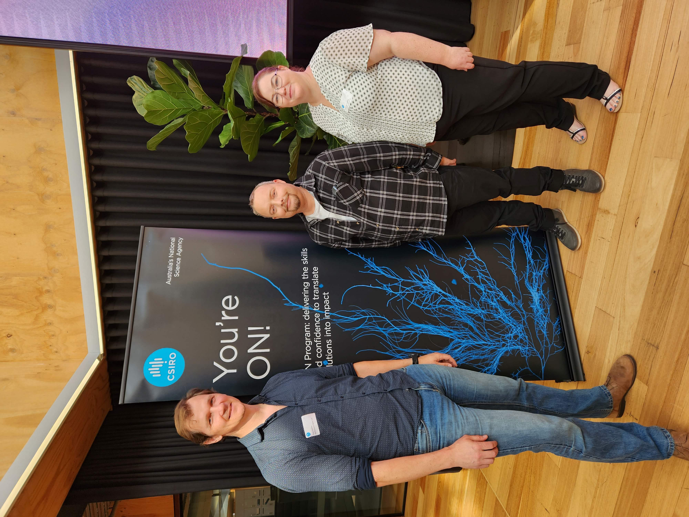
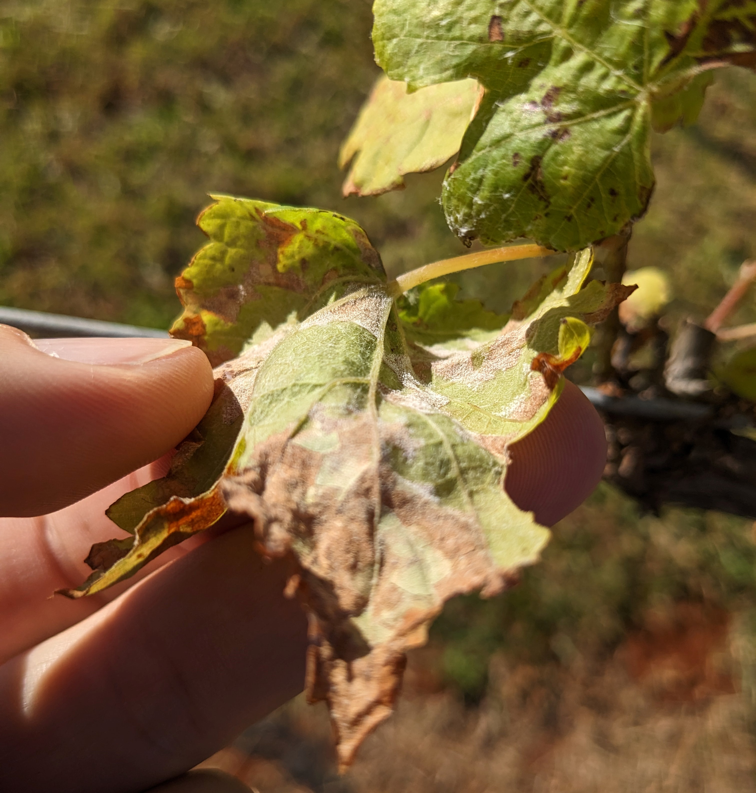

```{r message=FALSE, include=FALSE}
file.copy("./_site.yml","./blog/_site.yml",overwrite = TRUE)
file.copy("./_site.yml","./blog/2025/_site.yml",overwrite = TRUE)
```
`r htmltools::includeScript("./matamo.js")`

{style="float: right"}  

<br>  

I am a Agroecologist at [CSIRO.](https://www.csiro.au/)
I specialise in modelling pest and diseases in agriculture and horticulture for
using in decision support tools.  

Currently I am involved in two projects at CSIRO,  
 - [Canola Allies](https://research.csiro.au/pestreadi/) and  
 - [Pest READI](https://research.csiro.au/pestreadi/) 

Read about my recent research below, and if you are interested in collaborating
on a research topic, visit my [CSIRO profile page.](https://people.csiro.au/m/p/paul-melloy)


<br>  
<br>  

***  
#### November 2025

Show your support for a strong Australian scientific agency and sign this 
petition to lobby the Federal government to support the future industries in 
Australia borne by Australian science.  

<link href='https://actionnetwork.org/css/style-embed-v3.css' rel='stylesheet' type='text/css' /><script src='https://actionnetwork.org/widgets/v5/petition/csiro-needs-urgent-support?format=js&source=widget&referrer=[object Object]'></script><div id='can-petition-area-csiro-needs-urgent-support' style='width: 100%'><!-- this div is the target for our HTML insertion --></div>  


Reduced scientific capacity in Australia will result in reduced economic 
potential. [On average, for every \$1 invested in research $3.50 is ultimately 
returned to the economy.](https://www.csiro.au/en/work-with-us/services/consultancy-strategic-advice-services/CSIRO-futures/Innovation-Business-Growth/Quantifying-Australias-returns-to-innovation) 

<br>  

***  

## Recent work  
<br>  

### Opportunities and Challenges in Combining Optical Sensing and Epidemiological Modeling
#### September 2025

A new paper published in the special issue of *Pythopathology* on remote sensing 
opportunities in plant pathology. My role was to primarily focus on contributions to the section 
*Challenges in linking optical sensing and epidemiological modeling (Challenge C)*.

https://apsjournals.apsnet.org/doi/10.1094/PHYTO-11-24-0359-FI

<br>  

***  

### cercopoRa 0.0.2 update  
#### May 2025  

Quick post to report a new update to the package 
[cercopoRa](https://cran.r-project.org/web/packages/cercospoRa/index.html). 
Version 0.0.2 is now available on CRAN. 
Description of the key changes can be found on the 
[GitHub releases page](https://github.com/PaulMelloy/cercospoRa/releases/tag/v0.0.2) 
or the [NEWS site](https://paulmelloy.com.au/cercospoRa/news/index.html).  

<br>  

***  

### An introduction to the `arcgis` R package (blog)
#### March 2025  

I have been working with the `arcgis` R package to access and manipulate spatial
data from the ArcGIS online databases.
This blog post shows how to do this using the [Australian Tree Crop Map](https://www.une.edu.au/research/research-centres-institutes/applied-agricultural-remote-sensing-centre/collaborative-r-and-d-opportunities/industry-applications-and-maps/australian-tree-crops) database
(by UNE) as an example.  

[An introduction to the `arcgis` R package](https://paulmelloy.com.au/blog/2025/2503_aRcgis.html)  

<br>  

***  

### EvokeAg 2025 - Brisbane  
#### February 2025  

No rest for the wicked in February this year. 
From the 17th to the 20th I attended EvokeAg and some fantastic side-line events 
that gave some excellent insights on AgTech adoption concerns, broaden my network
and knowledge of AgTech services offered.

[To dive deeper and read my full report exploring 2025 EvokeAg and the sideline events here.](https://paulmelloy.com.au/blog/2025/2502_EvokeAg.html)  

<center>
{width=80%}
</center>


<br> 

***  

### GRDC Updates - Adelaide  
#### February 2025  

A successful visit to Adelaide to attend the GRDC updates and meet face to face 
for a Canola Allies project meeting.
We were able to build interest in the [Canola Allies](https://research.csiro.au/canolaallies/) 
project with a table display
inviting people to participate in a impact study to gain the current perspectives 
on pest management in canola and their views on where the research should focus. 
We had a great time talking with growers and agronomists about how they manage
pests on farm and what they would like to see in a decision support tool.

Also, I was able to sit in on a few presentations and found talks by 
[Rick Llewellyn](https://people.csiro.au/l/r/rick-llewellyn) 
*Digging Deeper - valuing plant and soil testing for agronomic decisions"* 
[Jonathon Richetti's](https://people.csiro.au/R/J/jonathan-richetti) talk on 
*"AI in Agriculture"* and 
[Julianne Lilley's](https://people.csiro.au/L/J/Julianne-Lilley) talk on
the [Crop flowering calculator](https://cropflowering.com.au/). 

Also great to catch up will Canola Allies colleagues and collaborators from the 
NSW DPIRD, SARDI and WA DPIRD. 
We followed on from the GRDC updates with a Canola Allies project meeting reported 
progress to the project's external advisory panel then discussed experimental 
approach moving forward on the projects four key outputs.  

  1. Improved understanding of beneficial biology and ecology in canola
  and a system to monitor these dynamics.  
  2. Estimation of the impact of beneficial to pest populations and canola productivity.  
  3. Evaluate the effect of on-farm semi-natural habitats on beneficial populations.
  4. Develop a spatial model to estimate the impact of landscape on beneficial 
  survival and pest suppression.  
  
<center>  

{width=70%}  
</center>


<br>  

***  

### viticolR name change  
#### January 2025  
I have changed the name of package viticolaR to viticolR. 
Anyone using this package will need to update thier cloned repositories or ensure
the urls are also updated.
New github URL: https://github.com/PaulMelloy/viticolR  
Decision support tool URL: https://apps.paulmelloy.com.au/shiny/viticolR_dst/  
Shout out to [Nick Tierney's blog](https://www.njtierney.com/post/2017/10/27/change-pkg-name/) which I followed to remind myself how to do this.

<br> 

***  

### cercopoRa 0.0.1 CRAN release
#### December 2024

I am pleased to announce that the [cercopoRa](https://cran.r-project.org/web/packages/cercospoRa/index.html) 
R package has been made available on the Comprehensive R Archive Network (CRAN). 
I have enjoyed collaborating with [Rene Heim](https://reneheim.github.io/), 
[Nathan Okole](https://orcid.org/0000-0002-5375-2420), 
[Facundo Ispizua](https://www.researchgate.net/profile/Facundo-Ispizua-Yamati), 
and [Anne-Katrin Mahlein](https://www.researchgate.net/profile/Anne-Katrin-Mahlein)
to produce this work as a foundation for further collaboration and development of
which I am looking forward to.

The `cercopoRa` package is designed to facilitate the integration of remote sensing 
data into epidemiological models. 
Its development builds on the research efforts of our team and aims to improve 
the automation and accuracy of these models.  

We invite researchers and practitioners interested in remote sensing and 
epidemiology to explore `cercopoRa`'s capabilities lodge issues for discussion and 
make pull requests to the 
[Github repository](https://github.com/PaulMelloy/cercospoRa/) to further this 
project.  

You can install the package from CRAN in R with the `install.packages()` function  

```r
install.packages("cercospoRa")
```

Access the documentation and tutorials from the pkgdown site 
https://paulmelloy.com.au/cercospoRa/.  

<br>  

***  


### LLMs for Decision Support
#### December 2024
Congratulations to [Dr Sandeep Dhakal](https://people.csiro.au/d/s/sandeep-dhakal) 
and [Dr Hazel Parry](https://people.csiro.au/P/H/Hazel-Parry.aspx) for their 
recent publication in [Nature Correspondance, *"Large language models can help to translate science into real-world impact"*](https://www.nature.com/articles/d41586-024-04059-w).  

Many academics are hesitant to embrace the Large Language Model revolution, however
the genie can no longer be put back in the lamp and it is integrating itself in 
our day-to-day life. 
What this technology does well  translate complex ideas and language
to a somewhat succinct summaries that are more readable. 
This is what we as scientists are rather terrible at, communicating complex ideas
to the wider public, and we could gain a lot by using LLMs to enable this.
The latest models have come a long way and even though it is probably for the LLM
to include mistakes, we as scientists should be involved in the testing to ensure
improved accuracy.  

<br>  

***  

### PlantSeg  
#### November 2024  
##### A Large-Scale In-the-wild Dataset for Plant Disease Segmentation  

While at UQ I collaborated with Computer Scientists Tianqi Wei, Zi Huang and Xin
Yu from the School of Electrical Engineering and Computer Science at UQ to 
develop a deep-learning segmentation model to identify and label RGB (Red Green Blue) 
plant diseases images. 
This work attempts to provide methods to identify diseases leaf area in images 
in the field, eliminating the need for destructive sampling and a plain 
background for contrast.  

I provided assistance in labelling some of the images, identifying source images, 
and writing the paper. 
This is an exciting step towards automation and quantifying disease severity in 
the field.  

You can read the full pre-print in [arXiv](https://arxiv.org/abs/2409.04038), 
view the code in [GitHub](https://github.com/tqwei05/PlantSeg) and obtain the 
image database in [Zenodo.](https://zenodo.org/records/13958858)

<br>  

***  

### AusMac Conference  
#### 30 - 31 October 2024  
The Pest READI project I'm working on focuses on horticultural industries in the 
Northern Rivers area of Northern New South Wales. This region has been severely 
impacted by recent disruptions, including [the 2022 floods](https://www.abc.net.au/news/2022-03-31/floods-lismore-byron-bay-northern-rivers-why-come-in-clusters/100954926) 
and the [black summer bushfires in 2020](https://www.abc.net.au/news/backstory/2023-09-26/abc-emergency-black-summer-upcoming-bushfire-season/102871620). 
The Pest READI team is conducting research on how this resilient community 
implements integrated pest management practices and collaborates with them to 
design tools that enhance preparedness and resilience for future changes.

The Northern Rivers region is home to significant horticultural industries, 
including macadamias, which are one of the largest in the area. 
Alongside avocados, these crops contribute significantly to the local economy. 
The conference, which brings together industry professionals, growers, and 
agronomists, featured a wide range of topics.

This year's event highlighted several key areas of focus. 
**Machinery and automation** were well-represented, with many attendees seeking 
solutions to reduce labor costs in the face of high demand for workers. However, 
the investment required to adopt new machinery was a significant consideration 
for farm businesses.

The conference also explored the importance of macadamia markets, which have 
faced challenges from competitors in South Africa and China. **Spatial models**, 
presented by [Andy Clark from UNE](https://www.une.edu.au/staff-profiles/science-and-technology/andy-clark), 
demonstrated how earth observation can be used to identify and map tree crops. 
These models also highlighted the potential for improved weather warning systems 
and monitoring of seasonal phenology.

The **Trade displays** offered a wealth of information on novel AgTech products 
targeting agricultural and horticultural production. 
Farm management platforms, such as [InformAg](https://www.informag.com.au/) and 
[FieldIn](https://fieldin.com/), were showcased as tools to organize farm tasks 
and improve record-keeping for compliance.

The importance of pollination was emphasized in several talks and at related 
stalls. 
[Bee Hero](https://www.beehero.io/) presented acoustic monitoring technology to 
understand bee activity, while [Wheen Bee](https://www.wheenbeefoundation.org.au/) 
offered grants for planting insect-friendly habitats. 
[Biological Services](https://www.biologicalservices.com.au/) supplied beneficial 
insects to suppress pests.

> [Read more about our round-up on our Pest READI website](https://research.csiro.au/pestreadi/pest-readi-team-at-ausmac-2024/)

<br>  

***  

### UQ Agronomy DST workshop  
#### 10 October 2024  
A workshop to introduce the benefits of consulting decision support tools (DSTs)
in Agriculture.  
[Class resources](https://paulmelloy.github.io/DST_Workshop.html)

<br>  

***  

### GRDC Soil-borne disease workshop  
#### August 2024  
Early this month I visited Sydney to talk at the GRDC soil-borne diseases workshop.
There were some interesting discussions about the complexity to manage soil and 
stubble borne diseases in grain crops. 
A primary concern was, despite heroic efforts by our Aussie plant pathologists, 
that past research was not easily able to translate to measurable impact.  
Additionally growers are not aware of the increasing chronic disease impact as a
result of increased stubble retention and zero till farming in Australia.  

Overwhelmingly there seems to be strong support for digital tools to help translate
research to impact and simplify disease management options with decision support
tools. 
However, will the rest of the GRDC research managers and regional panels agree???  

Thank you to [Colare](https://www.colere.com.au/) group for the invitation to talk.  

<br>  

***  

### New job at CSIRO!!!  
#### July 2024  

I am super excited to start a new role back with CSIRO as a Senior Research Scientist.
I will be working in a wider capacity on insect pests and diseases, engaging with
the horticultural industry and agri-tech platforms to integrate spatial models as 
decision support tools.  

I am working in the [agroecology team](https://research.csiro.au/agroecology/) 
with the [Pest READI](https://research.csiro.au/pestreadi/) and the [canola allies](https://research.csiro.au/agroecology/canola-allies/) project.  

**Update:** [A short blog post](https://research.csiro.au/agroecology/meet-our-new-team-members/) on myself and [Jessa Thurnman](https://people.csiro.au/t/j/jessa-thurman), starting with the 
agroecology team at CSIRO.  

<br>  

***  

### Australian Sports Turf Managers Association Conference  
#### June 2024  

What a treat giving a presentation on ERI diseases to a packed room at the ASTMA
Conference in Brisbane.  

<center>  

{width=60%}  
</center>

<br>  
<br>  

### weatherOz: API client for weather and climate data in R  
#### June 2024  

Congratulations to [Dr Rodrigo Pires](https://www.agric.wa.gov.au/rodrigo-pires) 
and [Prof. Adam Sparks](https://www.ccdm.com.au/people/adam-sparks/)
with this latest publication of which I am a co-author.  
[weatherOz: An API Client for Australian Weather and Climate Data Resources in R. (2024) \n Journal of Open Source Software, 9(98), 6717, \n https://doi.org/10.21105/joss.06717](https://joss.theoj.org/papers/10.21105/joss.06717)

<br>  


***  

### [13th International Epidemiology Workshop](https://iew13.netlify.app/)
#### April 2024  

What a fantastic workshop hosted by the [Socidedade Brasileira de Gitopatologia](https://sbfitopatologia.org.br/) 
(Brazilian Phytopathological Society).
The workshop took place in Iguasu and was a great opportunity to meet plant 
epidemiologists from around the world.  
I was able to speak on the first day of the workshop introducing the idea that
farmers might not be interested in JAFAs (Just another F___ *?fone?* App) and that 
using APIs to serve decision support tools to farm management software could reach
more stake-holders.  
I will look forward to the next workshop and seeing many of the same good folk and
new friends.  

<center>
{width=60%}
</center>

***  


### GRDC updates - Goondiwindi and Dubbo  
#### February/March 2024  
I presented a talk at "Efficiently limiting yield loss from net-blotch in barley 
– a meta-analysis" at the GRDC updates in Goondiwindi and Dubbo. 
This described the results of a meta-analysis of fungicide trials across Australia 
to determine the best fungicide timing to maximise yield protection.

Read about the results in the [GRDC GroundCover article](https://grdc.com.au/resources-and-publications/grdc-update-papers/tab-content/grdc-update-papers/2024/02/efficiently-limiting-yield-loss-from-net-blotch-in-barley-a-meta-analysis).

<center>
{width=60%}  

</center>

<br>  

***  

### `Extract` from nested lists in R  
#### November 2023  
`Extract`ing from lists and nested lists using the "[[" function is always a bit
of syntax I forget and can never seem to google the answer to easily.
So I post it here for myself to easily reference in the future. 
*Edit - more information can be obtained from* `?Extract`.  

Wearing my programming and data-science hats, lists can be a extremely useful 
way to store and organise data.
This is especially true for epidemiological model outputs.
Yet newcomers will find lists can be difficult to understand and find it even more
difficult to easily retrieve data from especially for nested lists.
This is a short-hand way to easily retrieve the same element within a nested list.  

First lets create a nested list.
```{r, R.options=list(max.print=20)}
# set random seed for reproducibility
set.seed(28)
nested_list <- lapply(1:3, function(x) {
  return(list(
    capitals = sample(LETTERS),
    smallcaps = sample(letters),
    numbers = sample(1:50)
  ))
})

#head(nested_list)
```
Here we have created a list with a length of 3 with three lists nested inside each
list with names "capitals", "smallcaps" and "numbers".  

Frequently we only want to pull all of one nested list. 
To do this we use two opening square brackets `"[["` as the function, followed by
the name of the list.  

```{r, R.options=list(max.print=20)}
lapply(nested_list,"[[", "capitals")
```

This also works by indicating the integer of the nested list i.e `lapply(list1,"[[", 2)`.
<br>  
<br>  

***

### OnPrime  
#### November 2023  
Through October and November I had the opportunity to develop my industry engagement
skills. 
The OnPrime program run by CSIRO provides researchers with coaching on how to improve
their engagement with industry and ensure improved outcomes for researchers and 
industry investors.
This program taught me how to develop a research project that is tailored to the 
needs of industry to ensure research gains are focused on what is novel and needed.

Our team researched the opportunity for developing a turf breeding program to support
the turf industry.  

I was surprised on the importance of turf in our culture, society and economy. 
We learned it can cost approximately $700k to import new varieties to Australia from
the US. 
These varieties may not even be suitable for Australia's varied and harsh climate.  
Sporting turf surfaces are at capacity, and with the rise in women's sport, demand 
is still growing placing a lot of pressure on sporting surfaces.
We could save sporting clubs money by developing a wear tolerant grass which reduces
the chance of cancelled games.
In addition a more tolerant turf for stadiums might increase the opportunity for 
more frequent games, concerts and events. 
Boosting revenue for the stadiums, local businesses and tourism.  

[Contact our team for more infomation about this project](https://paulmelloy.com.au/OnprimeContact.html)

<center>
{width=60%}
</center>

<br>  

***  


### International Conference of Plant Pathology (ICPP)  
#### August 2023  
It was a long time coming but this was my first International conference overseas. 
The [ICPP was held in Lyon](https://www.icpp2023.org/) and it was a scorcher!
The city was experiencing a heat wave which placed a topical spin on the conference
and how to manage plant diseases in a future experiencing the effects of climate 
change.  
<center>
{width=43.5%}  
</center>

The highlight for me was the [episense satellite meeting](https://www.icpp2023.org/sites/default/files/2023-08/Abstract_book_wtitpage_v8.7_030823_0.pdf) 
held on the preceding weekend. 
The air-conditioning could barely cope with the temperatures outside and despite the 
amazing talks, my attention could not help to wander to the Rhone river visable through
the window behind the speakers.  

The attendees of the Episense satellite meeting were genuinely good company and 
not only provided stimulating phytopathological discussions, but also extended a 
collaborative effort into robust research of the Lyonnaise cultural pursuits.  
{width=43.5%}
{width=43.5%}  


The conference was well attended by Aussies with the close of the meeting providing 
an opportunity to reflect on the conference insights and how they could be applied
in Australia.


<br>  


***

### UQ Agri-Food Innovation Alliance grant  
#### May 2023  
A quick visit to [Cauldron Distillery and Winery](https://www.cauldrondistillery.com.au/) 
to take soil and leaf samples for the UQ Industry Kick-starter project.  

<center>
While it was late in the season and the vines entering dormancy, we found, (Left) 
possible phosphorus deficiency in the ferrosol soils, and (Right) Possible downy mildew.  

{width=43.5%}
{width=55%}  

<br>  

Leaf samples revealed downy mildew _Plasmopara viticola_. 
Below: (Left) Sporangiophore, (Right) Sporangia  


{width=45%}
{width=50%}  
</center>
<br>  

***  

### UQ Agri-Food Innovation Alliance grant  
#### April 2023  
I am extremely excited to announce [Dr Anthony Young](https://agriculture.uq.edu.au/profile/4625/anthony-young) 
and myself were successful in an [Industry Kickstarter grant](https://agriculture.uq.edu.au/research/research-centres-and-groups/uq-agri-food-innovation-alliance/find-funding-or-research-partners)
to develop a "Decision support tool to support speciality smallholders and farm-gate 
producers."  

We are working with [Cauldron Distillery and Winery](https://www.cauldrondistillery.com.au/) 
in Mt Tamborine, south of Brisbane, to assess the efficacy of organic and synthetic 
fungicide timing on foliar grape vine diseases, powdery mildew and downy mildew. 
The field trial will assist in refining a decision support tool which will help 
smaller farm gate producer manage disease with lower costs and fungicide applications.  

<br>  

***  

### [The influence of temperature and vapour pressure deficit on conidial germination and germ tubes production in an Australian _Podosphaera xanthii_ isolate.](https://paulmelloy.github.io/P_xanthii_titlepage.html)  

#### March 2023  
This paper has been accepted and published in the European Journal of Plant Pathology.
[https://doi.org/10.1007/s10658-023-02664-5](https://doi.org/10.1007/s10658-023-02664-5)  

<br>  

***  

### Sampling Ascochyta rabaeii for field experiment  
#### February 2023  

Following the Goondiwindi GRDC updates I drove home via the Eastern Darling Downs
to collect some Ascochyta infested chickpea stubble. 
This will be used for inoculum in a field trial we are planning later this year.  
<center>
{width=60%}
</center>

<br>  

***  

### [The influence of temperature and vapour pressure deficit on conidial germination and germ tubes production in an Australian _Podosphaera xanthii_ isolate.](https://paulmelloy.com.au/P_xanthii_titlepage.html)  

#### November 2022  
I am pleased to share a pre-print of a paper I have been assisting with, titled, 
"The influence of temperature and vapour pressure deficit on conidial germination 
and germ tubes production in an Australian _Podosphaera xanthii_ isolate."
The paper has been submitted for review at the [European Journal of Plant Pathology](https://www.springer.com/journal/10658). The work was undertaken as part
of Zaiton Sapak's PhD and furthers our understanding on the temperature and vapour 
pressure conditions which influence germination rate and infection success of 
_P. xanthii_ on cucurbit leaves.  

Powdery mildew is at a high risk of evolving fungicide resistance and improper 
applications can be costly, hastening the evolution of fungicide resistance. 
Understanding the conditions at which the crop is at risk of infection will lead 
to the development of models and decisions support tools which increase the lead 
time to prepare for fungicide applications and timing sprays for maximum efficacy, 
reducing excessive spray applications or the immediate cost of applying ineffective 
poorly timed sprays.  

The results from this paper show the optimum conditions for rapid conidia germination
and the production of secondary and tertiary germ-tubes (a proxy for successful 
infection) was 28°C at saturated vapour pressure. Germination was prevented at 
temperatures above 34°C and below 8°C and reduced at other temperatures. As vapour 
pressure deficit increased germination and germ tube production decreased in a 
non-linear relationship and never completely prevented conidial germination or 
germ-tube production.  

I assisted with statistical analysis and final drafts of the paper. If you wish 
to read the pre-print, you can download it from Zenodo. 
[](https://doi.org/10.5281/zenodo.7349124)  

[You can also find the full statistical analysis and code at the research compendium here.](https://paulmelloy.github.io/P_xanthii_titlepage.html).  

<br>  

***  

### National Pulse Pathology Meeting & Ascochyta blight Workshop  
#### October 2022  
An amazing week of presentations and discussions around pulse pathology and ascochyta
blight research in chickpea. 
I had a great time learning about chickpea breading efforts and disease epidemiology
research.
I came away with some excellent insights that I wish to apply as improvements to 
the `ascotraceR` model. Watch this space.

</center>  

<br>  

***  

### GRDC Update - Miles - Pitsworth - Goondiwindi  
#### July 2022  
At the end of July, I travelled around South East Queensland to the GRDC Updates
to present the decision support tools which have been developed on the GRDC funded
project I am involved with. A second la nina at the start of 2022 has provided a 
lot of moisture which are likely to lead to heavy losses to foliar diseases if crops
are not managed well for disease.  

The main apps we were presenting for the Northern grains region were
[StripeRustWM](https://www.agric.wa.gov.au/apps/striperustwm) 
and [YellowSpotWM](https://www.agric.wa.gov.au/apps/yellowspotwm-yellow-leaf-spot-management).  

There was a lot of interest in the applications and many were not yet familiar with
the available suit of decision support tools (DST). With a full moisture profile across 
many of the cropping areas those who were able to sow had more options. With seemingly 
more growers from the Goondiwindi region going into canola. Some farm managers were
therefore interested in the canola DSTs [SclerotiniaCM](https://www.agric.wa.gov.au/apps/sclerotiniacm-sclerotinia-management-app),
and [UCI BlackLegCM](https://www.agric.wa.gov.au/apps/uci-blacklegcm-blackleg-upper-canopy-infection-management-app).

  

<br>  

***  

### Farms Advice - Plant disease modelling interview
#### June 2022
I had a great chat with ABC rural trailblazer [Jack Cresswell](https://twitter.com/jcressw3) on his [Farms Advice](https://farmsadvice.com.au/) pod-cast.  

[Follow this link to the interview.](https://anchor.fm/farmsadviceau/episodes/Plant-Disease-Modelling-in-Broadacre--Paul-Melloy-e1ji1kl)  

Or search for 'Farms Advice' in your pod-cast app.  

<br>  

***  

### Simulation model for ascochyta blight  
#### May 2022  

`ascotraceR` is an R package which simulates ascochyta blight epidemics in chickpea
crops.
You can find `ascotraceR` on CRAN, and a resource announcement in *Phytopathology*.

[ascotraceR: An R Package Resource to Simulate the Spatiotemporal Spread of Ascochyta Blight in a Chickpea Field Over a Growing Season](https://apsjournals.apsnet.org/doi/10.1094/PHYTO-01-22-0016-A)

<br>  

***  

### Is UniSuper's Defined Benefit Division fund worthwhile Shiny App  
#### May 2022  

Choice of superannuation is not the first type of research people like to do when starting a new job.
Most people want to finish the induction paperwork and financial forms as quickly as possible so they can commence diligently working for their new employer.
Therefore I gather most people would not fully dedicate their time to trying to understand 'What is a defined benefit division?' and 'Is it the best super product for me?'.
I certainly did not when I started work with the University of Southern Queensland almost four years ago.
I was coerced into UniSuper's DBD and only 3 years down the track I realise it was not for me.  

When checking up on my super balance, shortly after starting work at The University of Queensland, 
I noticed that the total contributions I made from my salary after tax exceeded the fund balance.
Suffice to say, I liken the DBD to a pyramid scheme which only benefits people who are over the age of 50. 
In fact it is almost impossible to have a positive net return if you exit the fund before the age of 46.  

To help people understand how the DBD is calculated I created a shiny app which can be found at the following link
[https://paulmelloy.shinyapps.io/UniSuperDBD/](https://paulmelloy.shinyapps.io/UniSuperDBD/)  

<br>  

***  

### 2022 Election shiny app  
#### May 2022  

I have been working on a shiny app to help a political party I am a member of, 
the [Fusion Party, *Science, Pirate, Secular and Climate Emergency Parties*](https://www.fusionparty.org.au/)  
The shiny app was made to easily convert electoral boundaries data from shape file
to `KML` file so they could be uploaded on a shared Google maps. 
Needless to say the app expanded monstrously when I found more data on the [AEC website](https://results.aec.gov.au/24310/Website/HouseDownloadsMenu-24310-Csv.htm).  

I included some analysis of voting preferences by division and voting booth, including
expected voter turnout to booths.  
Check out the app at https://paulmelloy.shinyapps.io/22_electoralboundaries/  

<br>  

***  

### Estimating leaf temperature from NASA satellite data  
#### April 2022  

I wrote a blog, published on OpenPlantPathology's website, for how to use R to 
estimate leaf temperatures from data retrieved using the `nasapower` R package. 
Then plugging the data into functions from the R package `tealeaves`.
The result is being able to estimate the leaf temperature for any where on the planet.

[Click here to read the blog post](https://openplantpathology.netlify.app/posts/2022-04-01-powerful-tea-using-nasapower-and-tealeaves-to-obtain-leaf-temperatures/)

<br>  

***  

### Efficient control of powdery mildew in mungbeans  
#### November 2021  

This paper uses meta-analytic methods to examine 16 field trials over eight seasons assessing fungicide spray timing for control of powdery mildew.  

[Read the paper in *Plant Disease*](https://apsjournals.apsnet.org/doi/10.1094/PDIS-06-21-1256-RE).  

[Recreate the analysis by following the research compendium.](https://openplantpathology.github.io/Mungbean_PM/preliminary-analysis.html)

